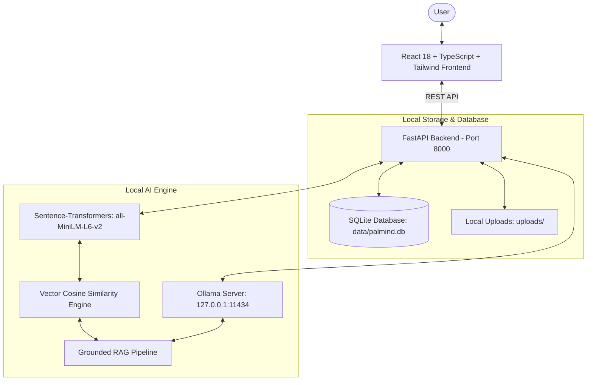

# PalMind

> **An AI companion that remembers what matters to you.**

[](https://opensource.org/licenses/MIT)
[](https://fastapi.tiangolo.com)
[](https://react.dev)
[](https://www.typescriptlang.org)
[](https://ollama.com)
[](https://huggingface.co/sentence-transformers/all-MiniLM-L6-v2)

---

## The Problem

College students and self-directed learners are overwhelmed with fragmented information:
- Exam deadlines are hidden in academic portals and emails.
- Lecture slides and notes are scattered across folders and cloud drives.
- Important verbal hints from professors (*"Hamming code calculations are on the midterm"*) get lost on scrap paper.
- Promises made to friends and teammates (*"I promised Rahul the presentation slides tomorrow before 6 PM"*) are forgotten in the daily rush.

Generic task managers lack memory and context. Cloud-based AI chatbots require pasting private lecture notes and assignments into proprietary third-party servers, charging per-token subscription fees that students cannot afford.

---

## Who I Built It For

I built **PalMind** for my close friend **Alex**, a university student balancing heavy engineering coursework, hackathons, and personal commitments. Alex didn't need another mechanical todo list; Alex needed a **private, local AI companion that remembers what matters to them**.

---

## The Solution: A Private Local AI Memory Layer

PalMind creates a unified, context-aware memory layer between the user's life and a local open-weight AI engine:

```text
          USER'S LIFE
              ↓
    Tasks + Notes + PDFs + Promises
              ↓
        LOCAL AI ENGINE
    (Ollama + Sentence-Transformers)
              ↓
     PERSONAL MEMORY LAYER
  (Vector Search + SQLite Database)
              ↓
   Context-Aware AI Companion
              ↓
 Priorities / Answers / Study Timers
```

---

## Key Features

1. **First-Run Onboarding**: Personalized setup that asks your name, learning goals, and peak productive hours, saving everything locally.
2. **Dashboard & AI "Focus For Today"**: Dynamic time-aware greeting synthesizing active deadlines, high-priority tasks, and upcoming promises into an actionable focus recommendation.
3. **Ask PalMind (Contextual RAG Chat)**: Ask questions naturally (*"What should I study tonight?"*, *"What did I promise Rahul?"*). PalMind retrieves relevant documents and memories before answering with verifiable source citations and page numbers.
4. **Flagship "My Memory" Vault**: Natural language memory ingestion with automatic classification (Academic, Commitment, People, Deadline, Preference, Project) and semantic vector search.
5. **Smart Tasks with Explainable AI Priority**: Enter tasks naturally (*"Finish MongoDB assignment by Friday at 5 PM"*). PalMind calculates an explainable 0–100 priority score based on deadline proximity and required effort.
6. **Document Intelligence**: Upload PDFs, TXT, Markdown, or DOCX notes. Text is extracted, chunked, and embedded locally with interactive grounded document Q&A.
7. **Study Mode & Real Focus Timer**: Select a topic and duration (25m Pomodoro, 45m, 60m). PalMind generates a structured study breakdown with an active countdown timer and persistent study analytics.
8. **Daily Briefing Deck**: A dedicated briefing deck highlighting today's priorities, forgotten commitments, recommended study sprints, and reminders.
9. **Local Reminders**: Schedule time-based study alerts with browser notification support and graceful in-app fallback.
10. **Global Command Bar (`Ctrl+K`)**: Rapid keyboard-driven navigation and search across all tasks, memories, and documents.
11. **Unified Global Search**: Single interface searching simultaneously across tasks, memories, documents, and notes.
12. **Privacy Center & Data Sovereignty**: Complete transparency into local models, one-click JSON data export, and full data wipe functionality.
13. **Settings & Dynamic Model Swapping**: Swap between Ollama models (`qwen2.5:7b`, `qwen2.5:3b`, `llama3.2`, etc.) and test live connection latency without touching application code.
14. **Dual Authentication & Account Support**: Sign in or create an account with Google Authentication or manual Gmail/email and password with secure PBKDF2 password hashing, session tokens, and interactive account switching.

---

## Why Open-Source AI Matters

PalMind was built to prove why open innovation is vital:
- **100% Privacy by Design**: Personal notes, assignment drafts, and private promises never leave your device.
- **Zero Inference Cost**: Run thousands of queries and document summaries without credit cards, subscriptions, or API rate limits.
- **Model Freedom**: Swap models effortlessly as better open-weight models are released.
- **Offline Reliability**: Continues to manage tasks, retrieve memories, and run study timers even when offline.
- **Resilient AI Fallback**: If Ollama is offline or uninstalled, PalMind never crashes—it displays clear setup guidance and provides deterministic database lookups.

---

## Technical Architecture



---

## Tech Stack

- **Frontend**: React 18, TypeScript, Vite, Tailwind CSS, Lucide React, Recharts
- **Backend**: Python 3.11, FastAPI, SQLAlchemy, SQLite, Pydantic V2, Uvicorn
- **AI & Inference**: Ollama (`qwen2.5:7b` or `qwen2.5:3b`), Sentence-Transformers (`all-MiniLM-L6-v2`)
- **Document Processing**: PyMuPDF (`fitz`), `python-docx`
- **Testing**: `pytest`, `pytest-asyncio`, `FastAPI TestClient`

---

## Local Installation

### Prerequisites
1. **Node.js** (v18+) and **npm**
2. **Python** (v3.10 or v3.11 recommended)
3. **Ollama**: Download from [ollama.com](https://ollama.com)

---

### Step 1: Set Up Ollama

Start the Ollama daemon and pull a model:
```bash
# Pull recommended model
ollama pull qwen2.5:7b
# OR for smaller hardware:
ollama pull qwen2.5:3b

# Start Ollama service (if not already running as a system service)
ollama serve
```

---

### Step 2: Set Up Backend

```bash
cd backend

# Create Python virtual environment
python -m venv .venv

# Activate environment:
# On Windows:
.venv\Scripts\activate
# On Linux/macOS:
source .venv/bin/activate

# Install dependencies
pip install -r requirements.txt

# Run backend
uvicorn app.main:app --host 127.0.0.1 --port 8000 --reload
```
The backend API will be available at **`http://127.0.0.1:8000`** (Swagger docs at `/docs`).

---

### Step 3: Set Up Frontend

In a new terminal:
```bash
cd frontend

# Install dependencies
npm install

# Start Vite development server
npm run dev
```
Open **`http://localhost:5173`** in your browser.

---

## One-Click Launch Scripts

For convenience, helper launcher scripts are provided:

- **Windows**: Double-click `start_all.bat` (or run `scripts/start_backend.bat` and `scripts/start_frontend.bat`).
- **macOS / Linux**: Run `chmod +x start.sh && ./start.sh`.

---

## Demo Seed Script

To populate the workspace with realistic student data (Alex's profile, Computer Networks tasks, exam deadlines, memories, and revision notes) for demonstrations:

```bash
# From project root with backend environment active:
python scripts/seed_demo.py
```

---

## Running Automated Tests

Run the full backend test suite:
```bash
cd backend
.venv\Scripts\pytest tests/test_backend.py -v
```

Test frontend build:
```bash
cd frontend
npm run build
```

---

## Docker Deployment

To run PalMind in Docker:
```bash
docker compose up --build
```
*Note: PalMind connects to your host machine's Ollama via `host.docker.internal:11434`.*

---

## License

This project is licensed under the MIT License. See [LICENSE](LICENSE) for details.
