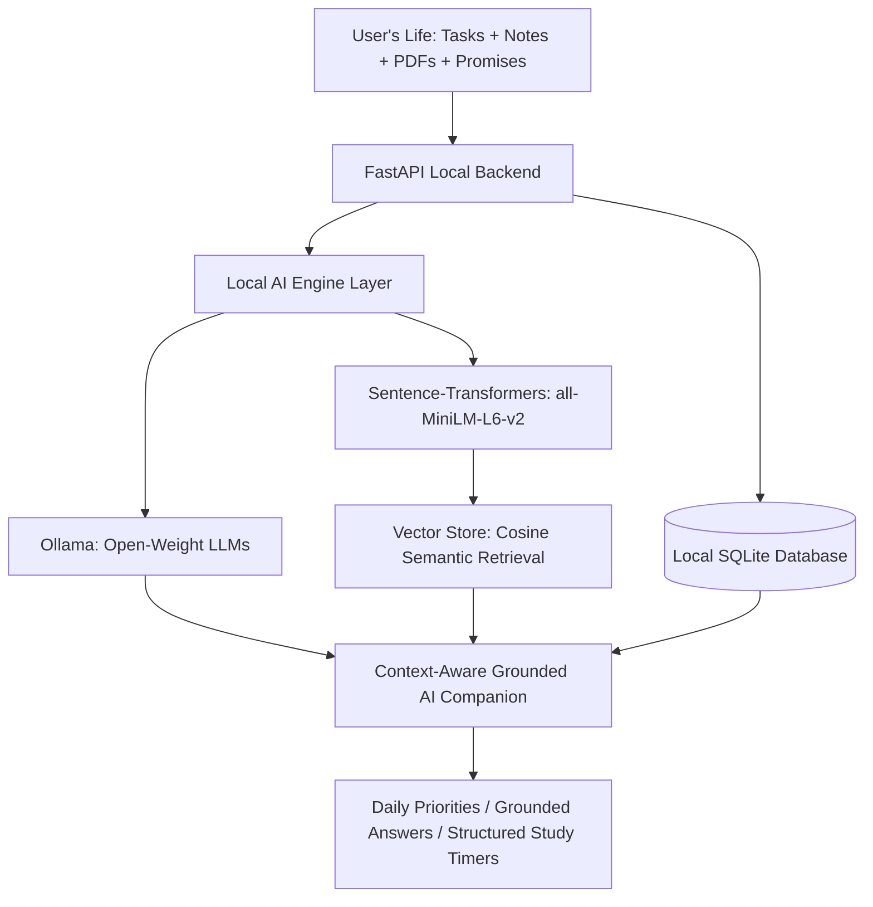

# I Built PalMind for a Friend Who Keeps Forgetting Important Things

> **"Your memories shouldn't require sending your life to someone else's server."**

---

## 1. The Friend

My friend Alex is a brilliant, hardworking computer science student. On any given week, they are balancing four high-level technical courses, collaborating on team hackathon projects, preparing for midterm examinations, and managing everyday life.

Alex has immense curiosity and capability, but their working memory was being stretched beyond human limits.

---

## 2. The Problem

Alex was constantly overwhelmed by cognitive fragmentation:

- **Deadlines were buried** across university portal notices, email threads, and group chats.
- **Lecture notes and study guides** were scattered across desktop folders and Downloads.
- **Crucial professor hints** ("*Make sure you understand Hamming Code and Stop-and-Wait ARQ calculations for the midterm*") were scribbled on scraps of paper or typed into WhatsApp self-notes, only to get lost.
- **Promises made to friends and teammates** ("*I promised Rahul I'll send the presentation slides tomorrow before 6 PM*") lived only in their head until they were almost missed.

When Alex tried traditional task manager apps, they found them rigid and mechanical. Traditional todo apps don't understand *context*; they can't answer "*What should I study tonight for the next 45 minutes?*" or "*What did I promise Rahul?*".

When Alex tried cloud-based commercial AI chatbots, they faced a different dilemma: **privacy and cost**. Pasting personal study notes, private promises, and draft assignments into third-party cloud servers felt invasive. Furthermore, cloud AI subscriptions and per-token API charges are untenable for college students.

Alex needed a **private, local AI companion that remembers what matters to them**.

---

## 3. What I Built

I built **PalMind**: an open-source, private local AI memory and study companion.

PalMind is not another generic todo list or ChatGPT wrapper. It is a **context-aware personal memory layer** that sits between a student's daily life and a local open-weight AI engine.

With PalMind, Alex can talk to their computer naturally:
- *"I have my Computer Networks exam next Tuesday."*
- *"I promised Rahul I'll send the presentation tomorrow."*
- *"Professor said ARQ and Hamming Code are guaranteed to be on the midterm."*
- *"What should I study first tonight?"*

PalMind understands the input, categorizes it, indexes it with dense vector embeddings, and retrieves it later to calculate dynamic priorities and grounded answers with source citations.

---

## 4. How It Works

PalMind operates across four synchronized subsystems:

### A. Natural Language Ingestion & Auto-Classification
Whether Alex types a quick task (*"Finish MongoDB assignment by Friday at 5 PM with High priority"*) or a casual memory (*"Rahul prefers meetings after 6 PM"*), PalMind automatically parses deadlines, categorizes items (Academic, Commitment, People, Deadline, Preference, Project), and computes dense vector representations.

### B. Grounded Retrieval-Augmented Generation (RAG)
When Alex asks a question in **Ask PalMind**, the system runs an embedding similarity search across both their personal memories and uploaded PDF/TXT notes. The prompt sent to the local Ollama LLM is strictly grounded in these excerpts, preventing hallucinations and providing verifiable source citations (including document name, page number, and relevant text).

### C. Explainable AI Priority Scoring
Instead of leaving priorities opaque, PalMind calculates a 0–100 priority score factoring in deadline proximity, base priority weighting, and estimated duration. Alex can click any task's score pill to inspect the exact mathematical and cognitive rationale.

### D. Deep Focus Study Mode
Alex can select a topic, choose a duration (25-min Pomodoro, 45-min, 60-min, or Custom), and receive an AI-generated, time-blocked schedule. An active countdown timer tracks focus intervals and writes verified study minutes to local database analytics.

---

## 5. Why Open Innovation Matters

Open-source AI is the foundational bedrock of PalMind, not an afterthought:

1. **Absolute Privacy & Data Sovereignty**: Personal promises, lecture notes, and study habits never leave Alex's laptop. There is zero telemetry or cloud logging.
2. **Zero Inference Cost**: Because inference runs via Ollama on local hardware, Alex can ask thousands of questions, summarize hundreds of pages of lecture slides, and re-run study plans without incurring API charges or credit card anxiety.
3. **Interchangeable Models**: Users are never locked into a single provider. Through environment variables or the UI Settings panel, PalMind can instantly swap between `qwen2.5:7b`, `qwen2.5:3b`, `llama3.2`, or `gemma4` without touching a line of code.
4. **Resilient Offline Capability**: Whether Alex is in a basement study room or traveling without Wi-Fi, PalMind continues to parse tasks, search memories, run study timers, and display briefings. If Ollama is offline, PalMind gracefully falls back to deterministic database retrieval rather than crashing.

---

## 6. What My Friend Said

> [Replace this with your friend's REAL feedback after they use PalMind.]

---

## 7. What's Next

- **Audio Whisper Integration**: Local voice dictation using open-source `whisper.cpp` for hands-free memory capture during lectures.
- **Cross-Device Local Sync**: Optional end-to-end encrypted peer-to-peer sync between laptop and mobile device over local Wi-Fi.
- **Spaced Repetition Flashcards**: Automatically generating flashcards from uploaded course slides based on the SM-2 spaced repetition algorithm.
